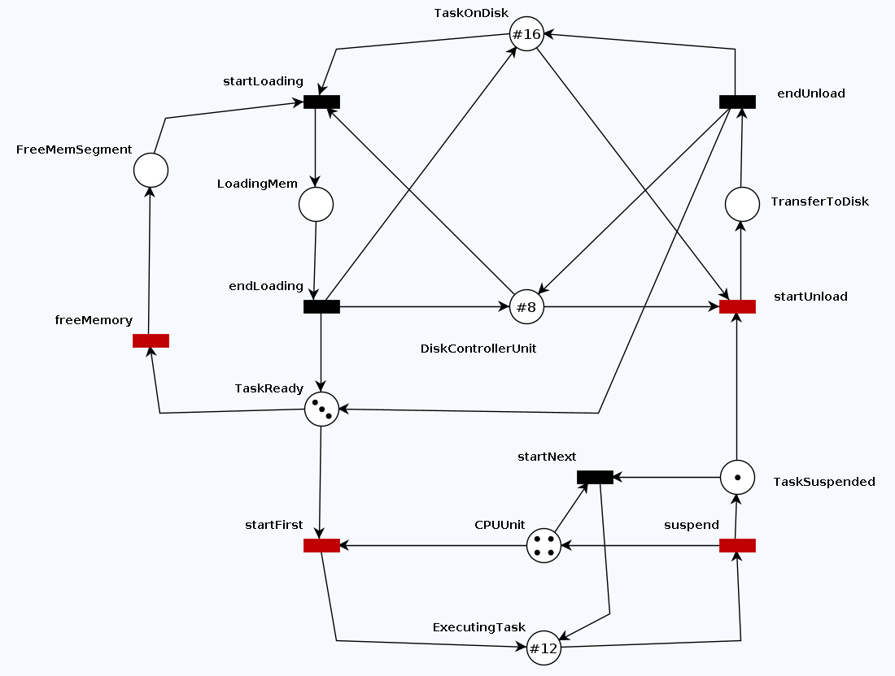

# PPGESE-Testability-TinyOS

## Problema

Escrever o modelo a seguir (**TinyOS**) na ferramenta de verificação de modelo de sua preferência e elabore propriedades de deadlock freedom (safety) e liveness.

## TinyOS no TAPAAL

### TAPAAL: Ferramenta para Verificação de Redes de Petri de Arco Temporizado

**TAPAAL** é uma ferramenta para

* modelagem, simulação e verificação de redes de Petri de arco temporizado (TAPN - *Timed-Arc Petri Net*)
* desenvolvido no Departamento de Ciência da Computação da **Universidade AAL**borg na Dinamarca e disponível para as plataformas Linux, Windows e Mac OS X.

Para mais informações da ferramenta [documentação](https://www.tapaal.net/documentation/ "Documentação do usuário")

### Simulação

### Verificação

* $AG~!(deadlock)$
* $AF~(EF~CPUUnit~\neq~0)$
* $AF~(EF~DiskControllerUnit~\neq~0)$
* $AF~(EF~ExecutingTask~\neq~0)$
* $AF~(EF~FreeMemSegment~\neq~0)$
* $AF~(EF~LoadingMem~\neq~0)$
* $AF~(EF~TaskOnDisk~\neq~0)$
* $AF~(EF~TaskReady~\neq~0)$
* $AF~(EF~TaskSuspended~\neq~0)$
* $AF~(EF~TransferToDisk~\neq~0)$

### Resultados

Para a configuração $MT16~DC8$:

| Query                                  | Result    | Verification Time | Query Property                         |
| -------------------------------------- | --------- | ----------------- | -------------------------------------- |
| Deadlock absence                       | Satisfied | 0.092 s           | AF !(deadlock)                         |
| DiskControllerUnit is always reachable | Satisfied | 0.101 s           | AF (EF TinyOS.DiskControllerUnit != 0) |
| ExecutingTask is always reachable      | Satisfied | 0.08 s            | AF (EF TinyOS.ExecutingTask != 0)      |
| FreeMemSegment is always reachable     | Satisfied | 0.072 s           | AF (EF TinyOS.FreeMemSegment != 0)     |
| LoadingMem is always reachable         | Satisfied | 0.072 s           | AF (EF TinyOS.LoadingMem != 0)         |
| TaskOnDisk is always reachable         | Satisfied | 0.071 s           | AF (EF TinyOS.TaskOnDisk != 0)         |
| TaskReady is always reachable          | Satisfied | 0.074 s           | AF (EF TinyOS.TaskReady != 0)          |
| TaskSuspended is always reachable      | Satisfied | 0.107 s           | AF (EF TinyOS.TaskSuspended != 0)      |
| TaskToDisk is always reachable         | Satisfied | 0.073 s           | AF (EF TinyOS.TransferToDisk != 0)     |

> NOTA: Demais informações podem ser obtidas [aqui](assets/TinyOS.pdf "TinyOS").
